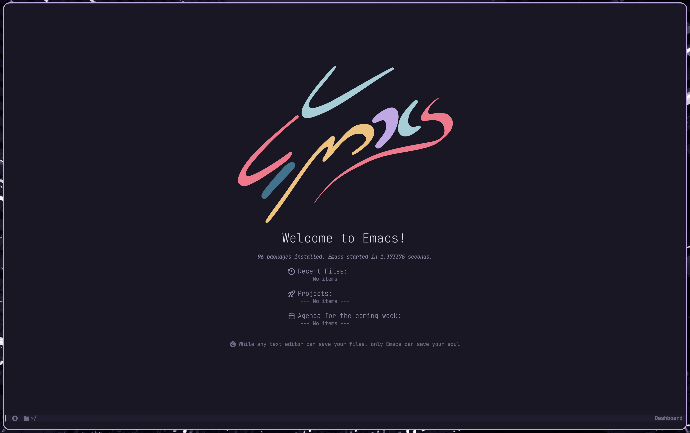
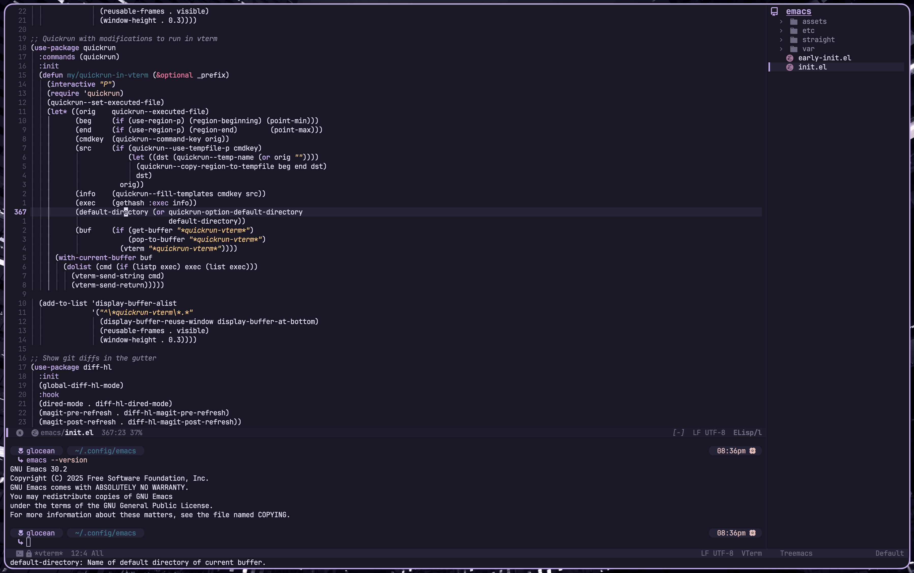

# 🪷 Glocean's .emacs.d

A minimal, high performance emacs configuration with full LSP support and org mode



---



## Features

- **Fast:** Many optimizations and lazy package loading.
- **Elegant:** Uses the beautiful Rose Pine theme, alongside nerd icons and a gorgeous dashboard.
- **Keybinds:** Vim motions with evil-mode, and quick leader keybinds with SPC
- **Org Mode:** The perfect zen environment for all your note taking needs.
- **Completion:** Vertico and Corfu support with fuzzy finding.
- **Coding:** Full support for LSP, debugging, syntax highlighting, and more.

## Prerequisites

This config is **macOS first**, tested only with [emacs-plus](https://github.com/d12frosted/homebrew-emacs-plus). It *might* work on Linux/*BSD, but you will need to change the shell paths and some macOS specific options.

### Dependencies

You can install all you need with homebrew on macOS:

```bash
# Core tools
brew install git enchant aspell automake autoconf pkg-config poppler zlib libvterm cmake

# For LaTeX, this is a giant package (about 6GB) so skip if you won't use it
brew install mactex

# Font, you can skip this if you have installed it another way already
brew install font-jetbrains-mono-nerd-font
```
## Installation

1. Remove or backup your old configuration directory (if you have one). Make sure you also remove the automatically generated `~/.emacs.d` directory.

2. Clone the repository

```bash
git clone https://github.com/gloceansh/.emacs.d.git ~/.config/emacs
```

3. Start Emacs. This will take a while on first startup, be patient while it pulls and compiles everything, it's not frozen
